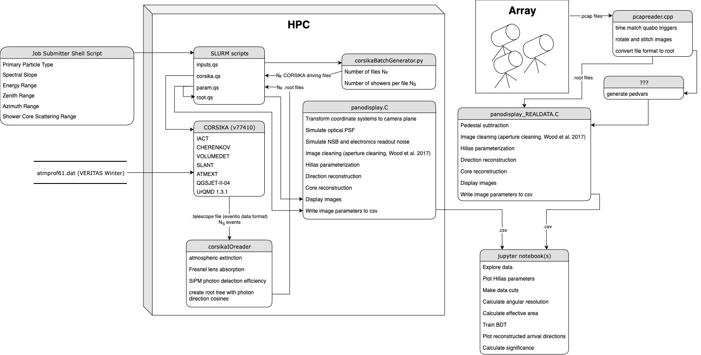

# PANOSETI-High-Energy-Analysis-Pipeline
Tools to analyze images of air showers captured by [PANOSETI](https://panoseti.ucsd.edu/) telescopes.

## Data Pipeline (WIP)

## simulation-tools
### Dependencies
* [ROOT](http://root.cern.ch/). Verified for version 6.28/04
* [CORSIKA 7](https://www.iap.kit.edu/corsika/index.php). Verified for version 77410. Compiled with the following options enabled:
    * IACT
    * CHERENKOV
    * VOLUMEDET
    * SLANT
    * ATMEXT
    * QGSJET-II-04
    * UrQMD 1.3.1
* [This version](https://github.com/nkorzoun/corsikaIOreader) of corsikaIOreader

### Installation
* Install dependencies and be sure to compile corsikaIOreader with `make corsikaIOreader`

### Example

### SLURM
Scripts for submitting jobs and analyzing data can be found [here](https://github.com/nkorzoun/panoseti-simulation/tree/main)